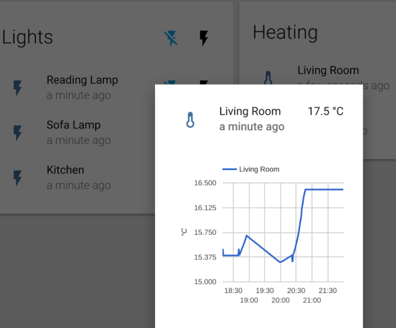

## OpenEnergyMonitor config for Home Assistant

[Home Assistant](https://home-assistant.io/) is an open-source home automation platform running on Python 3.


## My Home Setup Demo

Running on [emonPi](http://openenergymonitor.org/emon/emonpi) with [LightWave RF OOK plug control](https://github.com/openenergymonitor/lightwaverf-pi) and [MQTT WiFi relay](https://openenergymonitor.org/emon/modules/wifirelay) controling my boilder.





## Generic emonPi Config

See `configuration.yaml` in this repo and instructions below to setup the following then customise to your setup. Data is obtained from the emonPi via MQTT. Home Assistant connects to emonPi MQTT server. See here for more info regarding [emonPi MQTT topic structure](https://github.com/emoncms/emoncms/blob/master/docs/RaspberryPi/MQTT.md) 


## Install Home Assistant

For up-to-date install guide see [Home Assistant install guide](https://home-assistant.io/getting-started/)

Assuming starting with Raspbien Jessie (tested on [latest emonPi image](https://github.com/openenergymonitor/emonpi/wiki/emonSD-pre-built-SD-card-Repository-&-Change-Log) `emonSD-29Mar16`):

    sudo apt-get install python3-pip
    pip3 install homeassistant

Install and run with OEM configured `configuration.yaml` and custom dir config location on emonPi ~/data R/W partition:

```
git clone https://github.com/openenergymonitor/oem_home-assistant
mkdir ~/data/home-assistant
ln -s /home/pi/oem_home-assistant/configuration.yaml /home/pi/data/home-assistant/configuration.yaml
hass --config /home/pi/data/home-assistant
```

## Run on boot

```
sudo cp /home/pi/oem_home-assistant/home-assistant@pi.service /lib/systemd/system/home-assistant@pi.service
sudo systemctl --system daemon-reload
sudo systemctl enable home-assistant@pi
sudo systemctl start home-assistant@pi
```

Start / stop with:

    sudo systemctl start home-assistant@pi.service
    sudo systemctl start home-assistant@pi.service

To view log: `sudo journalctl -f -u home-assistant@pi`

## Optional:

```
sudo apt-get install python-Levenshtein
sudo  apt-get install net-tools nmap
```
