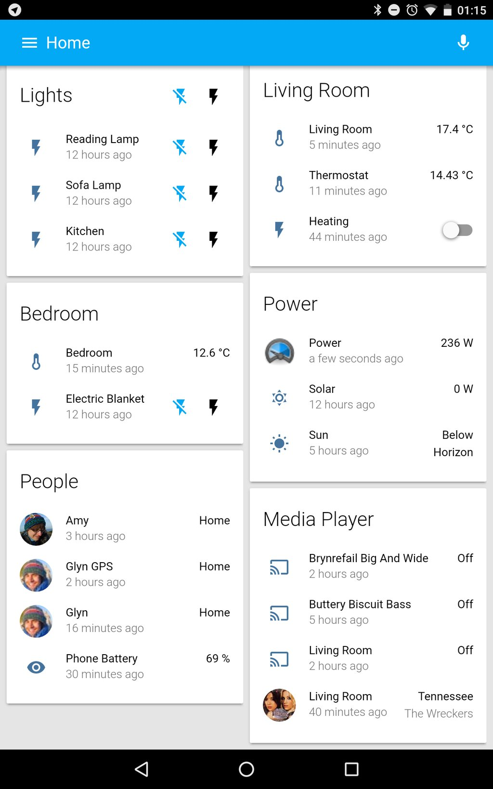

## OpenEnergyMonitor config for Home Assistant

[Home Assistant](https://home-assistant.io/) is an open-source home automation platform running on Python 3.


## My Home Setup Demo

Running on [emonPi](http://openenergymonitor.org/emon/emonpi) with [LightWave RF OOK plug control](https://github.com/openenergymonitor/lightwaverf-pi) and [MQTT WiFi relay](https://openenergymonitor.org/emon/modules/wifirelay) controling my boilder.




## Generic emonPi Config

See `configuration.yaml` in this repo and instructions below to setup the following then customise to your setup. Data is obtained from the emonPi via MQTT. Home Assistant connects to emonPi MQTT server. See here for more info regarding [emonPi MQTT topic structure](https://github.com/emoncms/emoncms/blob/master/docs/RaspberryPi/MQTT.md) 


## Install Home Assistant

For up-to-date install guide see [Home Assistant install guide](https://home-assistant.io/getting-started/)

Assuming starting with Raspbien Jessie (tested on [latest emonPi image](https://github.com/openenergymonitor/emonpi/wiki/emonSD-pre-built-SD-card-Repository-&-Change-Log) `emonSD-29Mar16`):

    sudo apt-get install python3-pip
    sudo pip3 install homeassistant

Home Assistant can now be ran manually with: 

    $ hass
 
Note: this will run with HA folder in the default location. Be default the emonPi keeps the root parition in Read Only mode. To make HA run with emonPi is in RO mode we need to move the HA folder to the RW partition mounted in ~/data. See below for instructions 

Install and run with OEM configured `configuration.yaml` and custom dir config location on emonPi ~/data R/W partition:

```
$ git clone https://github.com/openenergymonitor/oem_home-assistant
$ mkdir ~/data/home-assistant
$ ln -s /home/pi/oem_home-assistant/configuration.yaml /home/pi/data/home-assistant/configuration.yaml
hass --config /home/pi/data/home-assistant
```

## Run on boot

```
sudo cp /home/pi/oem_home-assistant/home-assistant@pi.service /lib/systemd/system/home-assistant@pi.service
sudo systemctl --system daemon-reload
sudo systemctl enable home-assistant@pi
sudo systemctl start home-assistant@pi
```

**Start / stop with:**

    sudo systemctl start home-assistant@pi.service
    sudo systemctl start home-assistant@pi.service

To view log: `sudo journalctl -f -u home-assistant@pi`

** Restart**

Home assistant can be restarted (this must be done after changing config) via web interface. You can restart HA by calling the homeassistant/restart service. Open the hamburger menu then click on the "remote" icon. Then you can select "homeassistant/restart" on the right hand side and press the "Call Service" button.

## Optional:

```
sudo apt-get install python-Levenshtein
sudo  apt-get install net-tools nmap
```

## Issues 

Since HA stores it's persistant DB in the HA data folder the default size of the data partition on the 4GB emonPi SD card is not sufficiant for log term use of HA. If using HA on emonPi it's recomneded to use at least 8GB and expand the data partion to fill the SD card see:

https://github.com/emoncms/usefulscripts#sdpart_imagefile
https://github.com/emoncms/usefulscripts/blob/master/sdpart/sdpart_imagefile
